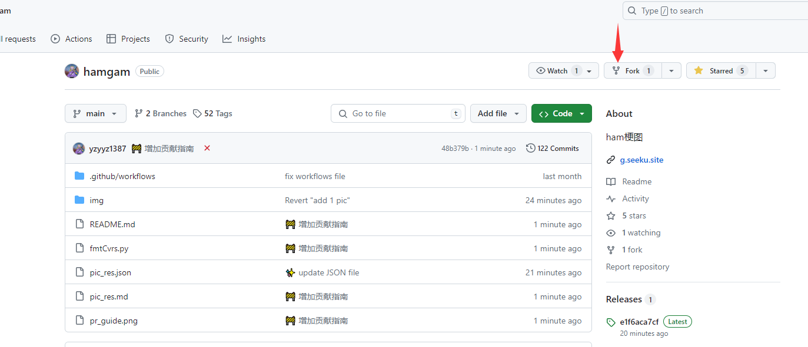
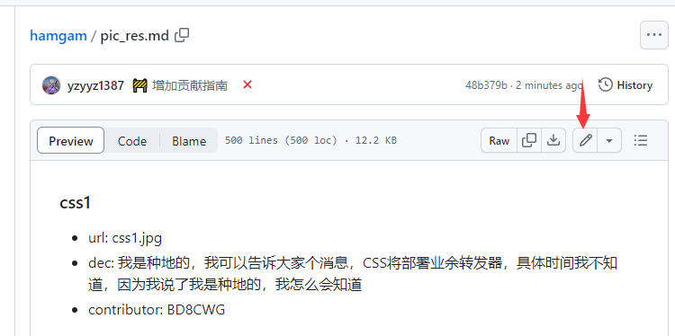
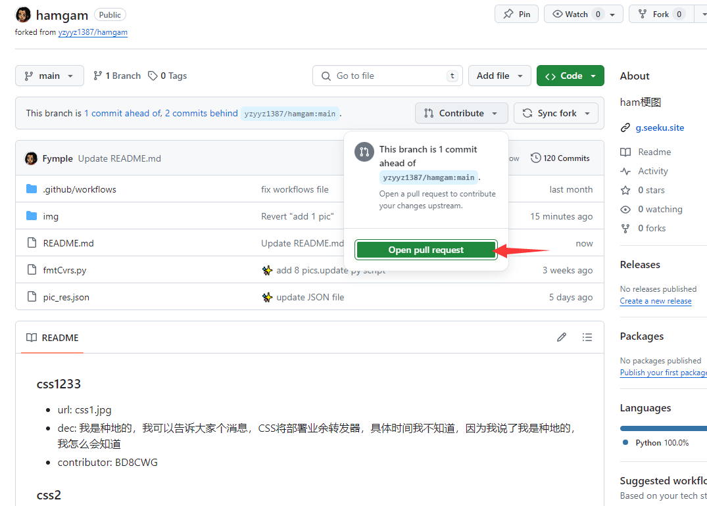

## 贡献指南
### Fork 本项目
点击右上角的 Fork 按钮，将本项目复制到你的账号下

### 更改
#### 本地开发(推荐)
使用VSC等编辑器本地开发
```bash
git clone https://github.com/yzyyz1387/hamgam.git
```
#### 在线编辑
通过网页编辑


### 具体操作
1. 在pic_res.md文件中追加：
```markdown
### 图片标题
- url: 图片文件名（带后缀）
- dec: 图片描述
- contributor: 贡献者
```

**请不要将数字开头作为图片标题**

2. 在`img`文件夹中上传图片
   建议压缩图片，以减少加载时间，可使用[tinypng](https://tinypng.com/)在线压缩

### 提交
1. 如果是本地开发，可通过编辑器可视化提交，或者使用命令行
```bash
git add .
git commit -m "提交信息"
```
2. 如果是在线编辑，可直接提交

### 推送
如果是本地开发，推送到远程仓库
使用编辑器可视化推送，或者使用命令行
```bash
git push
```

### 提交 PR
进入github，找到你的仓库, 应该会出先如图所示的按钮：

点击之，填写标题和描述，然后提交即可